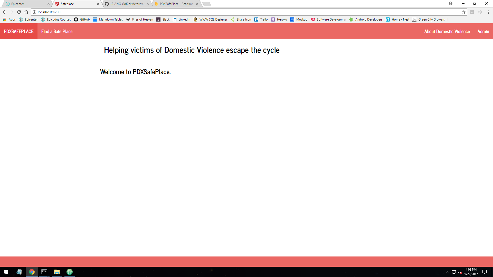

# PDXSafePlace Project Information

Too many times there are people that suffer from Domestic Violence that are, among other forms of abuse, suffering Financial Abuse. They are unable to leave the violent situation because they are the caregiver of the family and are unable to leave.

Table of contents
=================

  * [Table of contents](#table-of-contents)
  * [Project Info](#project-info)
    * [Documentation](#documentation)
  * [Installation](#installation)
  * [Specifications](#specifications)
  * [Known Bugs](#known-bugs)
  * [Contributing](#contributing)
  * [License](#license)

### Project Info
  
  Repository for Information about Project

### Documentation

  To see the full Project documentation, please visit: [Project](https://www.google.com/)

## Installation/Setup

Run `ng serve` for a dev server. Navigate to `http://localhost:4200/`. The app will automatically reload if you change any of the source files.

Run `ng generate component component-name` to generate a new component. You can also use `ng generate directive/pipe/service/class/module`.

Run `ng build` to build the project. The build artifacts will be stored in the `dist/` directory. Use the `-prod` flag for a production build.

Run `ng test` to execute the unit tests via [Karma](https://karma-runner.github.io).

Run `ng e2e` to execute the end-to-end tests via [Protractor](http://www.protractortest.org/).
Before running the tests make sure you are serving the app via `ng serve`.

## Specifications

| Behavior      | Example Input         | Example Output        |
| ------------- | ------------- | ------------- |
| user wants to locate a safe place to stay  | button click on item | safe place displayed |

## Known Bugs

* "Rich Garrick" <richg341@gmail.com>

## Contributing

If you would like to contribute to the Project repository please do the following:

1. Fork this project.
2. Create your feature branch: `git checkout -b my-new-feature`
3. Commit your changes: `git commit -am 'Add some feature'`
4. Push to the branch: `git push origin my-new-feature`
5. Submit a pull request :D

## License
The MIT License (MIT)
Copyright 2017 Rich Garrick

Permission is hereby granted, free of charge, to any person obtaining a copy of this software and associated documentation files (the "Software"), to deal in the Software without restriction, including without limitation the rights to use, copy, modify, merge, publish, distribute, sublicense, and/or sell copies of the Software, and to permit persons to whom the Software is furnished to do so, subject to the following conditions:

The above copyright notice and this permission notice shall be included in all copies or substantial portions of the Software.

THE SOFTWARE IS PROVIDED "AS IS", WITHOUT WARRANTY OF ANY KIND, EXPRESS OR IMPLIED, INCLUDING BUT NOT LIMITED TO THE WARRANTIES OF MERCHANTABILITY, FITNESS FOR A PARTICULAR PURPOSE AND NONINFRINGEMENT. IN NO EVENT SHALL THE AUTHORS OR COPYRIGHT HOLDERS BE LIABLE FOR ANY CLAIM, DAMAGES OR OTHER LIABILITY, WHETHER IN AN ACTION OF CONTRACT, TORT OR OTHERWISE, ARISING FROM, OUT OF OR IN CONNECTION WITH THE SOFTWARE OR THE USE OR OTHER DEALINGS IN THE SOFTWARE.
